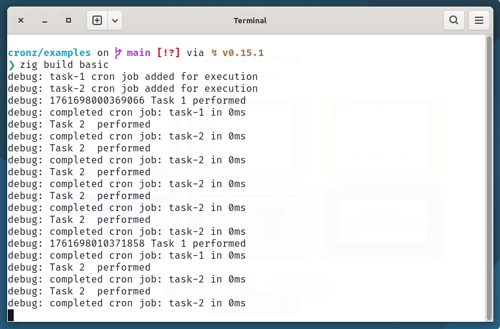

# cronz

The purpose of this `zig` library is to enhance the scheduling of the repeatable tasks using the crontab notation with zero allocations once it is set.

This module prefers crontab notation to provide a clear and concise understanding of task repetition.

Cronz even supports the second-level execution. `* * * * * *`

This `zig` module has few dependencies apart from the std library. Refer to the attribution for more.

Additionally, it offers a straightforward invocation that allows developers to easily define and manage their scheduling needs.

With its focus on simple and zero allocation, this library is ideal for applications requiring efficient task management.

### Example

```
const std = @import("std");
const Cronz = @import("cronz");

var allocator: std.mem.Allocator = undefined;

pub fn main() !void {
    var arena_instance = std.heap.ArenaAllocator.init(std.heap.page_allocator);
    defer arena_instance.deinit();
    allocator = arena_instance.allocator();

    const cronz = try Cronz.create(allocator);

    // executes tasks on every 0th, 10th, 20th, 30th and 40th second of each minute
    try cronz.AddCronJob("0,10,20,30,40 * * * * *", "task-1", task1);

    //execute tasks on every 2 second
    try cronz.AddCronJob("*/2 * * * * *", "task-2", task2);

    cronz.Run();
}

fn task1() !void {
    var msg: []u8 = undefined;
    msg = try allocator.alloc(u8, 100);
    msg = try std.fmt.bufPrint(msg, "Task 1 performed", .{});

    std.log.debug("{d} {s}", .{ std.time.microTimestamp(), msg });
}

fn task2() !void {
    var msg: []u8 = undefined;
    msg = try allocator.alloc(u8, 100);
    msg = try std.fmt.bufPrint(msg, "Task 2  performed", .{});

    std.log.debug("{s}", .{msg});
}
```




### Usage

Add cronz to your build.zig.zon:

```
zig fetch --save https://github.com/im-ng/cronz/archive/refs/heads/main.zip
```

Update module depency in build.zig

```
const cronz = b.dependency("cronz", .{});

exe.root_module.addImport("cronz", cronz.module("cronz"));
```

Now start importing as seen in above example.

### Notation Supported

| Format            | What it does?           | Mode |
| ----------------- | ----------------------- | --- |
| \* \* \* \* \* \* | Execute on every second | |
| 1-10 \* \* \* \* \* | Execute between 1-10 seconds of each minute| Range |
| \* *\/2  * * * * | Execute on every two minutes | Split |
| \* 1,3,5,10 * * * * | Execute on every 1st, 3rd, 5th and 10th Minute| Repeat |

Refer [crontab](crontab.guru) for more format support

## 🤝 Attribution

- [zig-regex](github.com/tiehuis/zig-regex.git)
- [zdt](https://codeberg.org/FObersteiner/zdt.git)

## 📄 License

This project is licensed under the MIT License - see the LICENSE file for details.
